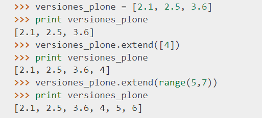
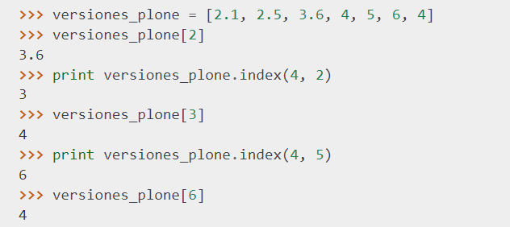

# Listas

1. ¿Que son? - ¿Para que sirve?
2. Sintaxis
3. Ejemplo

### ¿Que son y para que sirven?

#### En Python tiene varios tipos de datos compuestos y dentro de las secuencias, están los tipos de cadenas de caracteres. Otro tipo muy importante de secuencia son las listas.

#### Entre las secuencias, el más versátil, es la lista, para definir una, usted debe escribir es entre corchetes, separando sus elementos con comas cada uno.

#### La lista en Python son variables que almacenan arrays, internamente cada posición puede ser un tipo de datos distinto.

### Las listas son:
1. heterogéneas: pueden estar conformadas por elementos de distintos tipo, incluidos otras listas.
2. mutables: sus elementos pueden modificarse.

#### Los elementos de una lista pueden accederse mediante su índice, siendo 0 el índice del primer elemento. Los índices de una lista inicia entonces de 0 hasta el tamaño de la lista

## Metodos para interactuar con listas

### 1. Append() : Este método agrega un elemento al final de una lista.

### 2. count() : Este método recibe un elemento como argumento, y cuenta la cantidad de veces que aparece en la lista.

### 3. extend() : Este método extiende una lista agregando un iterable al final.

### 4. index() : Este método recibe un elemento como argumento, y devuelve el índice de su primera aparición en la lista.

#### El método admite como argumento adicional un índice inicial a partir de donde comenzar la búsqueda, opcionalmente también el índice final.

#### El método devuelve un excepción ValueError si el elemento no se encuentra en la lista, o en el entorno definido.

### 5. insert() : Este método inserta el elemento x en la lista, en el índice i.

### 6. pop() : Este método devuelve el último elemento de la lista, y lo borra de la misma.

### 7.  remove() : Este método recibe como argumento un elemento, y borra su primera aparición en la lista.

### El método devuelve un excepción ValueError si el elemento no se encuentra en la lista.

### 8. sort() : Este método ordena los elementos de una lista.

### El método sort() admite la opción reverse, por defecto, con valor False. De tener valor True, el ordenamiento se hace en sentido inverso

